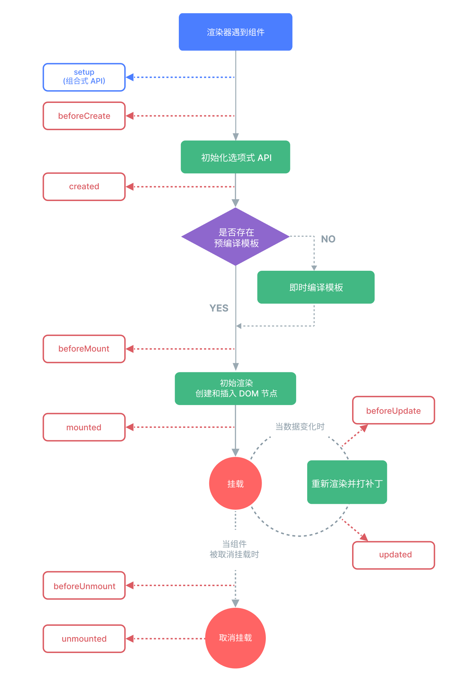

# lifecycle-hooks

## 生命周期

生命周期是指，组件从创建到销毁，所经历的一系列过程。在此过程中，会运行生命周期钩子函数。

## 生命周期钩子

注意。生命周期钩子，应当在组件初始化时，被同步注册。但这不意味着，对生命周期钩子的调用，必须在 `setup()` 或 `<script setup>` 内。生命周期钩子也可以在一个外部函数中调用，只要调用栈是同步的，且最终起源自 `setup()` 即可。

### onMounted

组件完成初始渲染并创建 DOM 节点之后执行相应的代码。

```vue
<template>
  <div>
    <p v-if="loading">加载中...</p>
    <p v-else-if="error">{{ error }}</p>
    <ul v-else>
      <li v-for="item in data" :key="item.id">{{ item.name }} - {{ item.email }}</li>
    </ul>
  </div>
</template>

<script setup>
import { onMounted, ref } from 'vue'

const loading = ref(false)
const error = ref(null)
const data = ref([])

async function fetchData() {
  loading.value = true
  error.value = null
  try {
    const res = await fetch('https://jsonplaceholder.typicode.com/users')
    if (!res.ok) throw new Error('请求失败')
    data.value = await res.json()
  } catch (err) {
    error.value = err.message
  } finally {
    loading.value = false
  }
}

onMounted(fetchData)
</script>
```

## 完整的生命周期

